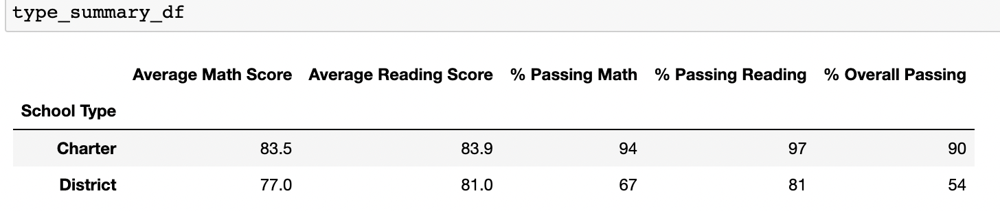

# School_District_Analysis

## Overview:
The purpose of this analysis was to see how corrupted data, from Thomas High School 9th graders, affected 
the original school district analysis.

## Results:
- ### Affect on District Summary
    - The district summary does not appear to be greatly affected by the removal of Thomas High School 9th graders. 
    The only item that seems to be different in any way is the Average Math Score. In the original data the Average Math Score 
    is 79.0 and in the updated challenge data it is 78.9. The Average Reading Score is 81.9 on both. For the % Passing on Reading, 
    Math, and Overall, different formatting was asked for between the two datasets. The data in both the original and updated 
    datasets essentially give the same number if both datasets were asked to be rounded to a whole number 
    (75-Math, 86-Reading, 65-Overall). Attached are screen shots from the original School District Summary and the updated School 
    District Summary, respectively.

    **School District Summary(Original)**                        
    
    **School District Summary(Challenge)**
    
    

- ### Affect on School Summary
    - The per school summary appears to be minimally affected after correcting the count for total students to not include 9th 
    grade student count at Thomas High School. The only data that has changed minimally is the Average Math Score, Average Reading 
    Score, % Passing Math, % Passing Reading, and % Overall Passing for Thomas High School. Those numbers look to have changed by 
    the following amounts(attached are screen shots of original data and updated data, respectively):
        - Average Math decreased by 0.08081%
        - Average Reading increased by 0.05623%
        - % Passing Math decreased by 0.09272% 
        - % Passing Reading decreased by 0.29815%
        - % Passing Overall decreased by 0.34931%

    **Per School Summary(Original)**
    
    **Per School Summary(Challenge)**
    

- ### Affect on Thomas High School's Performance Relative to the other schools.
    - If we don't adjust the total student count to remove the count of the students whose data was removed, we can see that Thomas
     High School's % Passing Math, % Passing Reading, and % Overall Passing differs greatly and much more poorly than most of the 
     other schools. When we change the total student counts to reflect the data more accurately by removing the number of 9th graders 
     at Thomas High School, we can see that Thomas High School's performance goes back to being more inline with the other 
     schools(attached are screen shots showing results before adjusting total student count and after from the updated data, 
     respectively). In fact they are still in the top five performing schools.

    **Per School Summary(Challenge-With 9th Grader Counts)**
    
    **Per School Summary(Challenge-Without 9th Grader Counts)**
    
    

- ### Replacing 9th Grader's Scores Affect on the following:
    - Math and Reading Scores by Grade
        - The only affect of removing the Thomas High School 9th graders' scores is that it is now showing as NaN on the data frames 
        we created for the analysis. It does not affect any of the other data in the data frame.

    **Original Math and Reading Scores by Grade**
    
    **Challenge Math an Reading Scores by Grade**
    

    - Scores by school spending
        - None, see the attached screen shots comparing original data to updated data:
    
    **Original Spending Summary**
    
    **Challenge Spending Summary**
    

    - Scores by school size
        - None, see the attached screen shots comparing original data to updated data:

    **Original Size Summary**
    
    **Challenge Size Summary**
    

    - Scores by school type
        - None, see the attached screen shots comparing original data to updated data:

    **Original School Type Summary**
    
    **Challenge School Type Summary**
    

## Summary:
Four changes that occurred after reading and math scores for the ninth grade at Thomas High School have been replaced with NaNs are 
the Average Math Score, Average Reading Score, % Passing Reading, % Passing Math, and % Overall Passing amounts changed for Thomas 
High School. The math and reading scores by grade data frames also changed, as the data under 9th grade for Thomas High School now
shows up as NaN.
